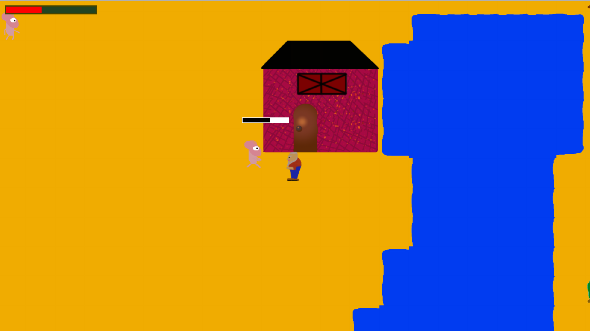

## Simple Top-Down Game

This repository provides a simple top-down game (ref: The Legend of Zelda NES) implemented with PyGame. The game has still some work to do when it comes to level design and graphics, but physics, combat and other logic elements are implented. Feel free to use this repository to design you own top-down adventure game.

#### To play the game, simply run the main python file in command line as:

```
python main.py
```


